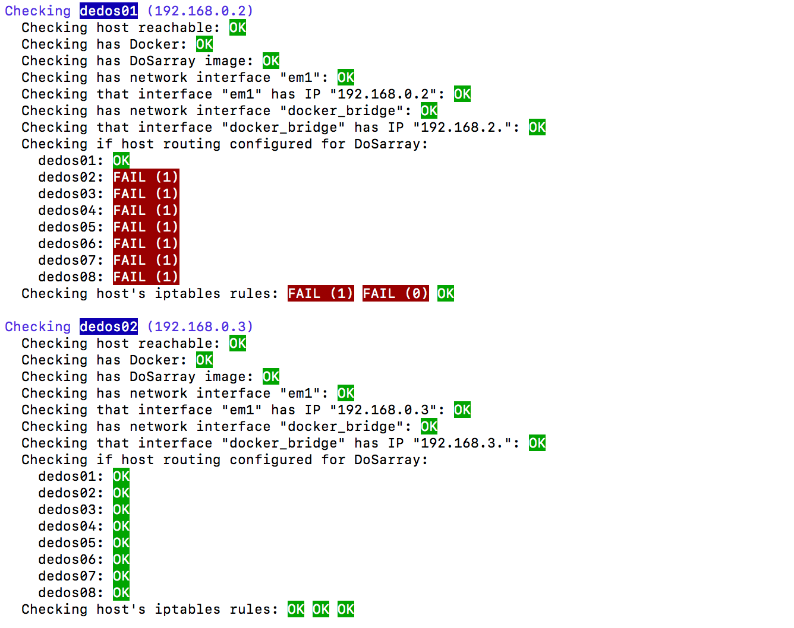

DoSarray is an [extensively documented](doc/README.md) system that facilitates carrying out experiments involving
[Denial-of-Service](https://en.wikipedia.org/wiki/Denial-of-service_attack) (DoS) attacks and mitigations.
It is developed at the University of Pennsylvania as part of the [DeDOS project](http://dedos-project.net/).

[DoStbin](https://gitlab.com/niksu/dostbin/) is a sister project that shares the results from DoSarray experiments.

You can also 3D-print the 3D graphs the produced by DoSarray. We have [documented](doc/3D_printing.md) how to do this.
The photo below shows an example from [one of the archived result
graphs](https://gitlab.com/niksu/dostbin/blob/master/results/1/graph.pdf) in
DoStbin:


## Getting started...
For a quick peek take a look at an
[example experiment](experiments/dosarray_slowloris_experiment.sh).
When run, this script generates the following output:
```
$ export DOSARRAY_SCRIPT_DIR=`pwd`
$ ./experiments/dosarray_slowloris_experiment.sh
Started HTTP experiment at Wed Jun  6 23:06:27 EDT 2018: apache_worker, slowloris, Default config
  Writing to /Users/nik/dosarray/example_experiment/
DoSarray stdout was collected in: /tmp/dosarray.stdout.yb39PO
DoSarray stderr was collected in: /tmp/dosarray.stderr.2QAwjY
Finished at Wed Jun  6 23:08:57 EDT 2018
```
The various logs and graphs generated by DoSarray could then be found in the
`example_experiment/` directory.
The output from this experiment can be seen in the
[DoStbin archive](https://gitlab.com/niksu/dostbin/tree/master/results/1).

Prior to running an experiment make sure to check that your cluster
is configured correctly. The [configuration
checker](src/dosarray_check_hosts.sh) script gives you informative break-down
of the findings, which can be made more detailed to help with diagnosing
problems:


## Documentation
Please see our [usage guide](doc/USAGE.md) which explains how to set DoSarray's
two levels of configuration: [DoSarray-wide](config/dosarray_config.sh) and
experiment-specific (such as in the
[example](experiments/dosarray_slowloris_experiment.sh) above).

We also have an [FAQ](doc/FAQ.md) and a [trouble-shoot checklist](doc/CHECKLIST.md).

## Multi-run experiments
Multiple runs of an experiment can be made by giving an additional
parameter to specify the number of runs required, as shown in our
[example experiment](experiments/dosarray_slowloris_experiment.sh).
The output is similar to that seen above, except that it shows
which run is being processed, and stores the output in a separate
subdirectory for each run:
```
Starting run 1 of 4
Started HTTP experiment at Wed Jun  6 23:56:35 EDT 2018: apache_worker, slowloris, Default config
  Writing to /Users/nik/dosarray/example_experiment_X4/1/
DoSarray stdout was collected in: /tmp/dosarray.stdout.OWUhaR
DoSarray stderr was collected in: /tmp/dosarray.stderr.nPCkjj
Finished at Wed Jun  6 23:59:05 EDT 2018
Starting run 2 of 4
Started HTTP experiment at Wed Jun  6 23:59:05 EDT 2018: apache_worker, slowloris, Default config
...
Finished at Thu Jun  7 00:01:34 EDT 2018
Starting run 3 of 4
Started HTTP experiment at Thu Jun  7 00:01:34 EDT 2018: apache_worker, slowloris, Default config
...
Finished at Thu Jun  7 00:04:02 EDT 2018
Starting run 4 of 4
Started HTTP experiment at Thu Jun  7 00:04:02 EDT 2018: apache_worker, slowloris, Default config
...
Finished at Thu Jun  7 00:06:30 EDT 2018
```
The output from this experiment can be seen in the
[DoStbin archive](https://gitlab.com/niksu/dostbin/tree/master/results/2).

## Contributors
Nik Sultana, Shilpi Bose.

## Current version
DoSarray 0.4

View [CHANGELOG](CHANGELOG.md)

## License
DoSarray is released under the [Apache 2.0 license](LICENSE)
