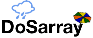

DoSarray is a system that facilitates carrying out experiments involving
[Denial-of-Service](https://en.wikipedia.org/wiki/Denial-of-service_attack) (DoS) attacks and mitigations.
It is developed at the University of Pennsylvania as part of the [DeDOS project](http://dedos-project.net/).

## Getting started...
For a quick peek take a look at an
[example experiment](experiments/dosarray_slowloris_experiment.sh).

Please see our [usage guide](doc/USAGE.md), which explains how to set the two
levels of configuration: [DoSarray-wide](config/dosarray_config.sh) and
experiment-specific (such as in the
[example](experiments/dosarray_slowloris_experiment.sh) above).

## Contributors
Nik Sultana, Shilpi Bose. More contributors welcome!

## Current version
DoSarray 0.2

## License
DoSarray is released under the [Apache 2.0 license](LICENSE)
