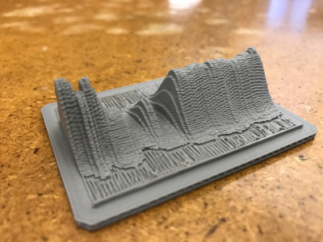
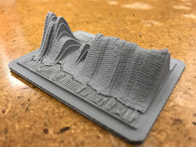

## How to print 3D graphs produced by DoSarray


> Big thanks to [André DeHon](http://www.seas.upenn.edu/~andre/) for explaining
> the 3D-printing options, helping with the 3D printing toolchain, and running
> the actual printing, and [Isaac Pedisich](https://isaac-ped.github.io/) for
> providing more info about the 3D printing options at [Penn](https://www.seas.upenn.edu/).

DoSarray can produce 3D graphs showing availability and latency information,
such as this
[example](https://gitlab.com/niksu/dostbin/blob/master/results/1/graph.pdf)
from DoStbin.

The pictures below shows what we can get by 3D printing the example referenced above:




To do this we tweaked DoSarray with a small [patch](3d_printing.patch) to
produced 3D graphs in a form where intensity is interpreted as depth. This is
what we got for the previous example: .

We then used standard 3D printing tools that take this 2D image and turn it
into a 3D model in a standard open format, and fed it into a 3D printing
toolchain.

Note that generating such graphs can be done retroactively for experiments,
and doesn't require redo-ing experiments. For the example mentioned earlier
we pbtained the
[availability.data](https://gitlab.com/niksu/dostbin/blob/master/results/1/availability.data)
file from the DoStbin archive, and ran the following command:
```
$ ${DOSARRAY_SCRIPT_DIR}/src/dosarray_graphing.sh -i "availability.data" -o "flattened_3d_graph.pdf" "Elavation map test" "10" "30"
```
