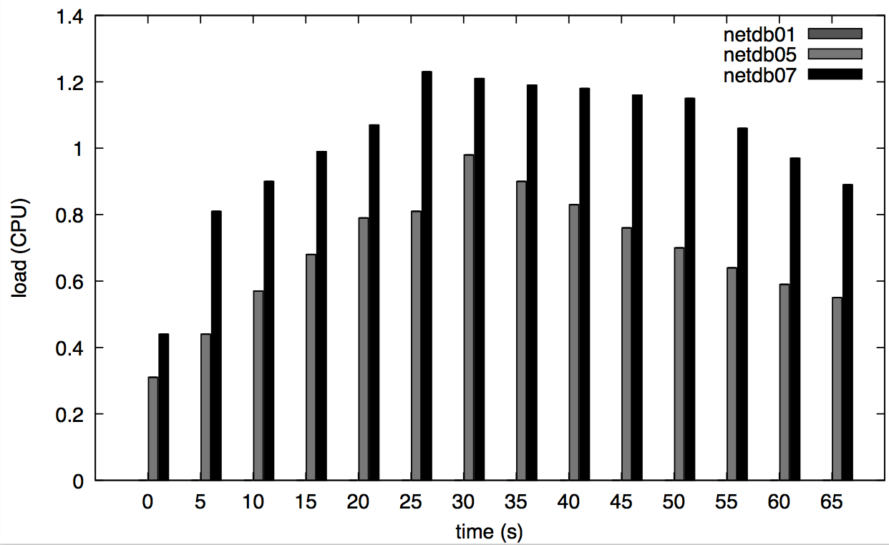

# FAQ

**1. DoSarray is not working, what can I do?**

Follow this [checklist](CHECKLIST.md) and look at other FAQ
answers below -- such as the one about firewalling.

**2. I run a cluster. Can I exclude DoSarray from running on some machines?**

Yes. Remove those machines from the appropriate fields in
[dosarray_config.sh](../config/dosarray_config.sh), then restart images
(`src/dosarray_stop_containers.sh` then `src/dosarray_delete_containers.sh`,
followed by `src/dosarray_create_containers.sh` then
`src/dosarray_start_containers.sh`), then `sudo service docker stop` on the
affected machines if DoSarray is the only Docker-using system that's running
on those machines.

**3. My servers have single NICs and they're assigned public IP addresses. Do I need a separate NIC to set up the private network between them for DoSarray?**

No. You can assign additional IPs to that NIC. On Ubuntu (tested on v16.04) this could be done as follows:
```
$ sudo vim /etc/network/interfaces
```
Let's say your NIC is called `eno49`. Then make an entry aliasing that NIC but providing a new address on a fresh network to be used for (physical) hosts using DoSarray.
```
auto eno49:1
iface eno49:1 inet static
address 192.168.0.1
netmask 255.255.255.0
```
Save your changes and restart the interface:
```
/etc/init.d/networking restart
```
And you should see the new interface:
```
$ ifconfig
...
eno49:1   Link encap:Ethernet  HWaddr XX:XX:XX:XX:XX:XX
          inet addr:192.168.0.1  Bcast:192.168.0.255  Mask:255.255.255.0
          UP BROADCAST RUNNING MULTICAST  MTU:1500  Metric:1
...
```
*NOTE* The logging you get is less precise we only gather logs for the "parent" NIC as described as [dosarray_filter_net_logs.sh](../src/dosarray_filter_net_logs.sh).

**4. My servers cannot be accessed directly, but through a sequence of one or more access nodes. Can DoSarray work through access nodes?**

Yes, this involves changing the functions `dosarray_execute_on()` and `dosarray_scp_from()` to do the necessary "hops" through the access nodes.
Look at [example](../config/dosarray_config.sh_accessnode) of how to do this.

**5. I cannot delete instances using `dosarray_delete_containers.sh`. What's wrong?**

Make sure you first *stop* the containers, otherwise they won't be deleted.
Inspect the host-based logs, since the controller output doesn't report failures:
For example, this is the output we can:
```
$ ./src/dosarray_delete_containers.sh
Deleting 10 instances
Deleting containers in dedos02 (192.168.0.3)
Pseudo-terminal will not be allocated because stdin is not a terminal.
Deleting containers in dedos03 (192.168.0.4)
Pseudo-terminal will not be allocated because stdin is not a terminal.
Deleting containers in dedos04 (192.168.0.5)
Pseudo-terminal will not be allocated because stdin is not a terminal.
Deleting containers in dedos05 (192.168.0.6)
Pseudo-terminal will not be allocated because stdin is not a terminal.
Deleting containers in dedos06 (192.168.0.7)
Pseudo-terminal will not be allocated because stdin is not a terminal.
Deleting containers in dedos07 (192.168.0.8)
Pseudo-terminal will not be allocated because stdin is not a terminal.
Deleting containers in dedos08 (192.168.0.9)
Pseudo-terminal will not be allocated because stdin is not a terminal.
Done
```

This is what the host-based logs report:
```
$ more /tmp/dosarray.std*
::::::::::::::
/tmp/dosarray.stderr
::::::::::::::
Error response from daemon: You cannot remove a running container e479743eed07c8d870ff99ca18ff027cb852f8501e7cd7b96b6d5397cbcfc0f5. Stop the container before attempting removal or force remove
Error response from daemon: You cannot remove a running container 6caaa1334be30ec8d04e8b643b287323004c82618275efff718467c38ad01817. Stop the container before attempting removal or force remove
Error response from daemon: You cannot remove a running container 3597f2cea9114d36edfbf25ee07a79ea626e9326cb85a4d29d669d67213d57df. Stop the container before attempting removal or force remove
Error response from daemon: You cannot remove a running container 09af2a5f7d54d3f47ba9d9f90796fe521c21cda5fe24b3e37ca0958674c48e65. Stop the container before attempting removal or force remove
Error response from daemon: You cannot remove a running container 9949e18d671832a2d9664a751dd726caa14d8f29f716a8558dcdf8efcb8a7aee. Stop the container before attempting removal or force remove
Error response from daemon: You cannot remove a running container 4ec2406089ad62e18cf0c6065dbe6dc54751a24b8a8483d577e3929a6aba7c23. Stop the container before attempting removal or force remove
Error response from daemon: You cannot remove a running container 45c0b38faa5376f4a905df83d99d8acc990c9fbb7ac02f09497ee78cc45287f6. Stop the container before attempting removal or force remove
Error response from daemon: You cannot remove a running container f088b0740583368fc352b727eb37451d05c36ca819efa12418171e11259c554b. Stop the container before attempting removal or force remove
Error response from daemon: You cannot remove a running container 7ec42ad82ad9842f28a7c641d10adec48df7bd1173d6765fbc12a173619d6bec. Stop the container before attempting removal or force remove
Error response from daemon: You cannot remove a running container b407b84a0e09494b832a4864fd04276b1f06a9b74504f59c1397aff21e2e3304. Stop the container before attempting removal or force remove
::::::::::::::
/tmp/dosarray.stdout
::::::::::::::
Tue Dec 25 18:11:20 EST 2018 starting dosarray_delete_containers.sh
  deleting c4.2
  deleting c4.3
  deleting c4.4
  deleting c4.5
  deleting c4.6
  deleting c4.7
  deleting c4.8
  deleting c4.9
  deleting c4.10
  deleting c4.11
Tue Dec 25 18:11:20 EST 2018 finishing dosarray_delete_containers.sh
```

**6. I'm not getting graphs of results. What's wrong?**

There might be several causes for this, so start by following out [checklist](CHECKLIST.md).

If you see this in `dossarray.stderr`:
```
min_seq_idx: -1
max_seq_idx: -1
```
then it means that the experiment's duration couldn't be inferred from the data (i.e, the experiment took no time at all, so there's nothing to analyse, which can't be the case).
The analysis script couldn't make sense of the raw log.
Looking at the raw log we see:
```
PING 192.168.0.2:8011 (http://192.168.0.2):
connect time out
connect time out
connect time out
connect time out
connect time out
```
This indicates a connectivity problem between the container and the target.

**7. I checked the target's logs, and it mentions IP addresses of the physical hosts. Shouldn't it mention containers' IPs?**

Yes -- it appears that the physical machines are NATting the containers. Check the iptables configuration. Look at the [network configuration script](../dosarray_configure_networking.sh)

The lack of address diversity is the tell-tale sign that networking isn't configured correctly. For example:
```
192.168.0.5 - - [26/Nov/2018:00:50:08 -0500] "HEAD / HTTP/1.0" 200 -
192.168.0.5 - - [26/Nov/2018:00:50:08 -0500] "HEAD / HTTP/1.0" 200 -
192.168.0.5 - - [26/Nov/2018:00:50:08 -0500] "HEAD / HTTP/1.0" 200 -
192.168.0.5 - - [26/Nov/2018:00:50:08 -0500] "HEAD / HTTP/1.0" 200 -
192.168.0.5 - - [26/Nov/2018:00:50:08 -0500] "HEAD / HTTP/1.0" 200 -
192.168.0.5 - - [26/Nov/2018:00:50:08 -0500] "HEAD / HTTP/1.0" 200 -
192.168.0.7 - - [26/Nov/2018:00:50:08 -0500] "HEAD / HTTP/1.0" 200 -
192.168.0.5 - - [26/Nov/2018:00:50:08 -0500] "HEAD / HTTP/1.0" 200 -
192.168.0.7 - - [26/Nov/2018:00:50:08 -0500] "HEAD / HTTP/1.0" 200 -
192.168.0.7 - - [26/Nov/2018:00:49:47 -0500] "GET / HTTP/1.1" 408 221
192.168.0.5 - - [26/Nov/2018:00:50:10 -0500] "HEAD / HTTP/1.0" 200 -
192.168.0.5 - - [26/Nov/2018:00:50:10 -0500] "HEAD / HTTP/1.0" 200 -
192.168.0.5 - - [26/Nov/2018:00:50:10 -0500] "HEAD / HTTP/1.0" 200 -
192.168.0.7 - - [26/Nov/2018:00:50:10 -0500] "HEAD / HTTP/1.0" 200 -
192.168.0.5 - - [26/Nov/2018:00:50:10 -0500] "HEAD / HTTP/1.0" 200 -
192.168.0.5 - - [26/Nov/2018:00:50:10 -0500] "HEAD / HTTP/1.0" 200 -
192.168.0.5 - - [26/Nov/2018:00:50:10 -0500] "HEAD / HTTP/1.0" 200 -
192.168.0.5 - - [26/Nov/2018:00:50:10 -0500] "HEAD / HTTP/1.0" 200 -
192.168.0.7 - - [26/Nov/2018:00:50:10 -0500] "HEAD / HTTP/1.0" 200 -
192.168.0.7 - - [26/Nov/2018:00:50:10 -0500] "GET / HTTP/1.1" 400 226
192.168.0.7 - - [26/Nov/2018:00:50:10 -0500] "GET / HTTP/1.1" 400 226
```

You should be seeing the IP addresses of containers mentioned in the logs instead. For example:
```
192.168.5.9 - - [03/Dec/2018:23:00:12 -0500] "HEAD / HTTP/1.0" 200 -
192.168.5.6 - - [03/Dec/2018:23:00:12 -0500] "HEAD / HTTP/1.0" 200 -
192.168.5.5 - - [03/Dec/2018:23:00:12 -0500] "HEAD / HTTP/1.0" 200 -
192.168.5.10 - - [03/Dec/2018:23:00:12 -0500] "HEAD / HTTP/1.0" 200 -
192.168.5.8 - - [03/Dec/2018:23:00:12 -0500] "HEAD / HTTP/1.0" 200 -
192.168.5.11 - - [03/Dec/2018:23:00:12 -0500] "HEAD / HTTP/1.0" 200 -
192.168.7.4 - - [03/Dec/2018:23:00:12 -0500] "HEAD / HTTP/1.0" 200 -
192.168.7.6 - - [03/Dec/2018:23:00:12 -0500] "HEAD / HTTP/1.0" 200 -
192.168.7.7 - - [03/Dec/2018:23:00:12 -0500] "HEAD / HTTP/1.0" 200 -
192.168.7.8 - - [03/Dec/2018:23:00:12 -0500] "HEAD / HTTP/1.0" 200 -
192.168.7.10 - - [03/Dec/2018:23:00:12 -0500] "HEAD / HTTP/1.0" 200 -
```

**8. The [configuration checker](../src/dosarray_check_hosts.sh) seems to be getting stuck during one of the checks.**

Most likely it's trying to run a remote command that involves `sudo` and is blocked at the prompt for the sudo password. One way of solving this involves removing the password prompt for sudo for the account you're using for DoSarray. This could be done by running `$ sudo vim /etc/sudoers` and editing sudo's configuration file. You can restrict which commands you can run without a password through sudo; to be able to run all commands then add the following line (replacing `<USERNAME>` with the username you're using for this purpose -- good sense should apply when doing this since it removes a layer of security between normal and privileged access to the target system):
```
<USERNAME> ALL=(ALL) NOPASSWD: ALL
```

**9. The [configuration checker](../src/dosarray_check_hosts.sh) has indicated that a check has ["failed"](dosarray_check_hosts.png). Can I get more detailed information about how it failed?**

Yes -- look for the `POST_COMMAND` variable in that script and assign it to the empty string (`""`). That variable controls what happens to output that's obtained from the DoSarray nodes, and by default that output is discarded. By setting the variable to `""` then that output will be printed to you, and can give you clues about what the failure consisted of.

**10. Occasionally CPU load appears to be empty, but this is impossible. What's wrong?**

We're aware of this since we've seen it happen sometimes (but not very frequently) but we're not sure why it arises or how to avoid it. Because of how we carry out load measurements, the cause seems to be deep -- outside DoSarray -- because the zeros show up in the raw data we gather from the userspace tools (which in turn query the kernel's data structures). We've only seen this happen for CPU load.

For example, this is a load graph we had got -- note how "netdb01" never appears to have any load:


The raw log we got for that machine, directly from userspace tools, shows that the load we measured was indeed 0:
```
$ cat netdb01_load.log
netdb01 1552831438 0.00 0.00 0.00 5/942 35416
netdb01 1552831443 0.00 0.00 0.00 2/1077 35598
netdb01 1552831448 0.00 0.00 0.00 2/1078 35658
netdb01 1552831453 0.00 0.00 0.00 2/1079 35712
netdb01 1552831458 0.00 0.00 0.00 2/1079 35730
netdb01 1552831463 0.00 0.00 0.00 2/1079 35748
netdb01 1552831468 0.00 0.00 0.00 2/1079 35758
netdb01 1552831473 0.00 0.00 0.00 2/1078 35767
netdb01 1552831478 0.00 0.00 0.00 2/1026 35778
netdb01 1552831483 0.00 0.00 0.00 2/917 35788
netdb01 1552831488 0.00 0.00 0.00 2/917 35798
netdb01 1552831493 0.00 0.00 0.00 3/915 35808
netdb01 1552831498 0.00 0.00 0.00 2/917 35818
netdb01 1552831503 0.00 0.00 0.00 2/915 35827
```

The only work-around we're aware of currently involves rerunning the experiment.
